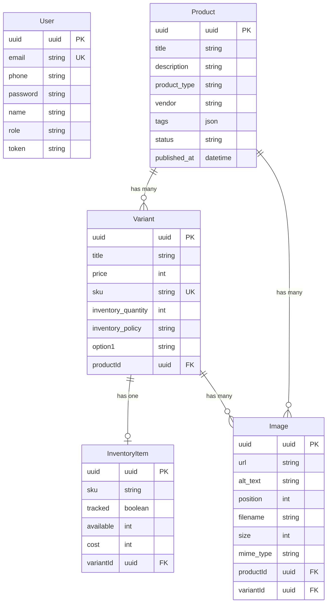

# Michi Sweatshop - Project Overview

## 📋 Ringkasan Project

**Michi Sweatshop** adalah backend API untuk aplikasi e-commerce yang dibangun menggunakan **Bun runtime** dan **Hono framework**. Project ini menyediakan REST API untuk manajemen produk, variant, inventory, dan user authentication.

---

## 🛠️ Teknologi Stack

### Runtime & Framework

- **Runtime**: [Bun](https://bun.sh/) - JavaScript runtime yang cepat dan modern
- **Framework**: [Hono](https://hono.dev/) v4.9.9 - Web framework yang ringan dan cepat
- **Language**: TypeScript

### Database & ORM

- **Database**: PostgreSQL
- **ORM**: Prisma v6.16.2
- **Schema Location**: `prisma/schema.prisma`

### Dependencies Utama

- `@prisma/client` - Prisma ORM client
- `@scalar/hono-api-reference` - API documentation dengan Scalar UI
- `hono` - Web framework
- `winston` - Logging library
- `zod` v4.1.11 - Schema validation

---

## 📁 Struktur Project

```
michi-sweatshop/
├── prisma/
│   ├── schema.prisma          # Database schema
│   └── migrations/            # Database migrations
├── src/
│   ├── Application/           # Database connection & config
│   ├── controller/            # HTTP request handlers
│   │   ├── product-controller.ts
│   │   ├── user-controller.ts
│   │   └── variant-controller.ts
│   ├── service/               # Business logic layer
│   │   ├── product-service.ts
│   │   ├── user-service.ts
│   │   └── variant-service.ts
│   ├── model/                 # TypeScript interfaces & types
│   │   ├── product-model.ts
│   │   ├── user-model.ts
│   │   ├── variant-model.ts
│   │   ├── inventory-item-model.ts
│   │   └── image-model.ts
│   ├── validation/            # Zod validation schemas
│   │   ├── product-validation.ts
│   │   └── user-validation.ts
│   ├── middleware/            # HTTP middlewares
│   │   └── auth-middleware.ts
│   ├── utils/                 # Utility functions
│   ├── generated/             # Prisma generated client
│   ├── index.ts               # Application entry point
│   └── openapi.ts             # OpenAPI specification
├── doc/                       # API documentation
│   ├── product.md
│   ├── user.md
│   └── variant.md
├── uploads/                   # File upload directory
├── test/                      # Test files
├── package.json
└── tsconfig.json
```

---

## 🗄️ Database Schema

### Model: User

Menyimpan data pengguna dan autentikasi.

**Fields:**

- `uuid` (UUID, Primary Key) - ID unik user
- `email` (String, Unique) - Email user (digunakan untuk login)
- `phone` (String) - Nomor telepon
- `password` (String) - Password ter-hash
- `name` (String) - Nama lengkap (digunakan untuk display)
- `role` (String, default: "user") - Role user (user/admin)
- `token` (String?, Nullable) - JWT token untuk autentikasi
- `createdAt` (DateTime) - Waktu pembuatan
- `updatedAt` (DateTime) - Waktu update terakhir

### Model: Product

Menyimpan informasi produk utama.

**Fields:**

- `uuid` (UUID, Primary Key)
- `title` (String) - Nama produk
- `description` (String) - Deskripsi produk
- `product_type` (String) - Tipe/kategori produk
- `vendor` (String) - Vendor/supplier
- `tags` (JSON) - Array tags untuk filtering
- `status` (String) - Status produk (active/draft/archived)
- `published_at` (DateTime?, Nullable) - Waktu publikasi
- `created_at` (DateTime)
- `updated_at` (DateTime)

**Relations:**

- `images` → Image[] (One-to-Many, Cascade Delete)
- `variants` → Variant[] (One-to-Many, Cascade Delete)

### Model: Variant

Menyimpan variasi produk (ukuran, warna, dll).

**Fields:**

- `uuid` (UUID, Primary Key)
- `title` (String) - Nama variant
- `price` (Int) - Harga dalam satuan terkecil (cents/rupiah)
- `sku` (String, Unique) - Stock Keeping Unit
- `inventory_quantity` (Int) - Jumlah stok
- `inventory_policy` (String) - Policy stok (deny/continue)
- `option1` (String) - Opsi variant (e.g., "Standard", "Large")
- `created_at` (DateTime)
- `updated_at` (DateTime)
- `productId` (UUID, Foreign Key)

**Relations:**

- `product` → Product (Many-to-One, Cascade Delete)
- `inventory_item` → InventoryItem? (One-to-One, Cascade Delete)
- `images` → Image[] (One-to-Many, Cascade Delete)

### Model: InventoryItem

Menyimpan detail inventory untuk setiap variant.

**Fields:**

- `uuid` (UUID, Primary Key)
- `sku` (String)
- `tracked` (Boolean) - Apakah stok di-track
- `available` (Int) - Jumlah tersedia
- `cost` (Int) - Harga modal
- `created_at` (DateTime)
- `updated_at` (DateTime)
- `variantId` (UUID, Unique, Foreign Key)

**Relations:**

- `variant` → Variant (One-to-One, Cascade Delete)

### Model: Image

Menyimpan gambar produk dan variant.

**Fields:**

- `uuid` (UUID, Primary Key)
- `url` (String) - URL/path gambar
- `alt_text` (String?, Nullable) - Teks alternatif
- `position` (Int, default: 0) - Urutan tampilan
- `created_at` (DateTime)
- `updated_at` (DateTime)
- `productId` (UUID?, Nullable, Foreign Key)
- `variantId` (UUID?, Nullable, Foreign Key)
- `filename` (String?, Nullable) - Nama file
- `size` (Int?, Nullable) - Ukuran file (bytes)
- `mime_type` (String?, Nullable) - MIME type
- `width` (Int?, Nullable) - Lebar gambar
- `height` (Int?, Nullable) - Tinggi gambar

**Relations:**

- `product` → Product? (Many-to-One, Cascade Delete)
- `variant` → Variant? (Many-to-One, Cascade Delete)

**Constraints:**

- Unique constraint: `[productId, position]`
- Unique constraint: `[variantId, position]`

---

## 🔌 API Endpoints

### User Management

#### Register User

```
POST /api/users
```

**Request Body:**

```json
{
  "username": "string",
  "email": "string",
  "phone": "string",
  "password": "string",
  "name": "string"
}
```

#### Login User

```
POST /api/users/login
```

**Request Body:**

```json
{
  "email": "string",
  "password": "string"
}
```

**Response:** Returns user data with JWT token

> **Note:** Login menggunakan `email`, bukan `username`

---

### Product Management

#### Create Product

```
POST /api/products
Authorization: Bearer {token}
```

**Request Body:**

```json
{
  "title": "string",
  "description": "string",
  "product_type": "string",
  "vendor": "string",
  "tags": ["string"],
  "status": "active|draft|archived",
  "variants": [
    {
      "title": "string",
      "price": 0,
      "sku": "string",
      "inventory_policy": "deny|continue",
      "option1": "string",
      "inventory_item": {
        "sku": "string",
        "tracked": true,
        "available": 0,
        "cost": 0
      }
    }
  ],
  "images": [
    {
      "url": "string",
      "alt_text": "string",
      "position": 0
    }
  ]
}
```

#### Get All Products (Paginated)

```
GET /api/products?page=1&limit=10
```

**Response:** Returns paginated product list

#### Get Product by ID

```
GET /api/products/{uuid}
```

**Response:** Returns product with variants and images

#### Get Product Detail (with Inventory)

```
GET /api/products/{uuid}/detail
```

**Response:** Returns product with variants, images, and inventory items

#### Update Product

```
PATCH /api/products/{uuid}
Authorization: Bearer {token}
```

**Request Body:** Partial update (semua field optional)

#### Delete Product

```
DELETE /api/products/{uuid}
Authorization: Bearer {token}
```

**Response:** Returns `{ "data": true }`

---

### Image Upload

#### Upload Image File

```
POST /api/products/{uuid}/images/upload
Authorization: Bearer {token}
Content-Type: multipart/form-data
```

**Form Data:**

- `image` (File, required) - Image file
- `alt_text` (String, optional)
- `position` (Number, optional)

**Validations:**

- File must be an image
- Max file size: 2MB
- Stored in: `./uploads/products/{productId}/`

#### Upload Image URL

```
POST /api/products/{uuid}/images
Authorization: Bearer {token}
```

**Request Body:**

```json
{
  "url": "string",
  "alt_text": "string",
  "position": 0
}
```

---

### Variant Management

#### Create Variant

```
POST /api/variants
Authorization: Bearer {token}
```

#### Get Variant by ID

```
GET /api/variants/{uuid}
```

#### Update Variant

```
PATCH /api/variants/{uuid}
Authorization: Bearer {token}
```

#### Delete Variant

```
DELETE /api/variants/{uuid}
Authorization: Bearer {token}
```

---

## 🔐 Authentication & Authorization

### Middleware: `auth-middleware.ts`

- Memvalidasi JWT token dari header `Authorization: Bearer {token}`
- Token disimpan di database pada kolom `User.token`
- Jika token tidak valid atau tidak ada, return 401 Unauthorized
- User yang terautentikasi disimpan di context: `c.set('user', user)`

### Protected Routes

Routes yang memerlukan autentikasi:

- `POST /api/products` - Create product
- `PATCH /api/products/:uuid` - Update product
- `DELETE /api/products/:uuid` - Delete product
- `POST /api/products/:uuid/images` - Upload image URL
- `POST /api/products/:uuid/images/upload` - Upload image file
- `POST /api/variants` - Create variant
- `PATCH /api/variants/:uuid` - Update variant
- `DELETE /api/variants/:uuid` - Delete variant

### Public Routes

Routes yang dapat diakses tanpa autentikasi:

- `GET /api/products` - List products
- `GET /api/products/:uuid` - Get product detail
- `GET /api/products/:uuid/detail` - Get product with inventory
- `GET /api/variants/:uuid` - Get variant detail

---

## 📚 API Documentation

Project ini menggunakan **Scalar API Reference** untuk dokumentasi interaktif.

### Akses Dokumentasi

```
GET /docs
```

Membuka UI dokumentasi API yang interaktif

### OpenAPI Spec

```
GET /openapi.json
```

Mendapatkan OpenAPI specification dalam format JSON

---

## 🔧 Configuration & Environment

### Environment Variables

File: `.env`

**Required:**

- `DATABASE_URL` - PostgreSQL connection string
- `UPLOAD_DIR` (optional) - Directory untuk file upload (default: `./uploads`)

### Running the Application

**Install dependencies:**

```bash
bun install
```

**Run development server:**

```bash
bun run dev
```

**Run database migrations:**

```bash
bunx prisma migrate dev
```

**Generate Prisma client:**

```bash
bunx prisma generate
```

**Access:**

- API: `http://localhost:4000`
- Documentation: `http://localhost:4000/docs`

---

## 🎯 Fitur Utama

### 1. Product Management

- ✅ CRUD operations untuk products
- ✅ Support multiple variants per product
- ✅ Inventory tracking per variant
- ✅ Image management (URL-based & file upload)
- ✅ Pagination untuk product listing
- ✅ Tags untuk categorization

### 2. Image Management

- ✅ Upload gambar via file (multipart/form-data)
- ✅ Upload gambar via URL
- ✅ File validation (type & size)
- ✅ Automatic file naming dengan UUID
- ✅ Metadata storage (filename, size, mime_type, dimensions)
- ✅ Position-based ordering
- ✅ Public access via `/uploads/*` route

### 3. Inventory Management

- ✅ Track inventory per variant
- ✅ Inventory policy (deny/continue)
- ✅ Cost tracking
- ✅ Available quantity management

### 4. User Authentication

- ✅ User registration
- ✅ User login dengan JWT token
- ✅ Token-based authentication
- ✅ Role-based access (user/admin)

### 5. Validation & Error Handling

- ✅ Zod schema validation
- ✅ UUID validation untuk semua ID
- ✅ Custom error classes (ValidationError, DuplicateError, AuthenticationError)
- ✅ Centralized error handling
- ✅ Proper HTTP status codes

### 6. CORS & Security

- ✅ CORS enabled untuk semua `/api/*` routes
- ✅ Bearer token authentication
- ✅ Selective route protection

---

## 📝 Catatan Penting

### Cascade Delete

Semua relasi menggunakan `onDelete: Cascade`, artinya:

- Menghapus Product → otomatis menghapus semua Variants, Images, dan InventoryItems terkait
- Menghapus Variant → otomatis menghapus InventoryItem dan Images terkait

### UUID Generation

Semua ID menggunakan PostgreSQL function `gen_random_uuid()` untuk generate UUID secara otomatis.

### File Upload

- Files disimpan di `./uploads/products/{productId}/`
- Filename menggunakan UUID untuk menghindari konflik
- Max file size: 2MB
- Supported formats: semua image types

### Price & Cost

Semua harga dan cost disimpan dalam **integer** (satuan terkecil), misalnya:

- Rp 800.000 → disimpan sebagai `800000`
- $10.50 → disimpan sebagai `1050` (cents)

---

## 🚀 Development Notes

### Hot Reload

Development server menggunakan `bun run --hot` untuk hot reload otomatis saat file berubah.

### Prisma Client

Prisma client di-generate ke `src/generated/prisma/` (custom output path).

### Logging

- Request logging menggunakan Hono's built-in logger middleware
- Winston tersedia untuk custom logging

### Testing

Test files tersimpan di direktori `test/`.

**Run all tests:**

```bash
bun test
```

**Test Coverage:**

- 33 test cases
- User authentication tests
- Product CRUD tests
- Variant management tests
- Image upload tests
- 97% pass rate

---

## 📖 Dokumentasi Tambahan

Dokumentasi API detail tersedia di:

- [doc/product.md](doc/product.md) - Product API documentation
- [doc/user.md](doc/user.md) - User API documentation
- [doc/variant.md](doc/variant.md) - Variant API documentation

---

## 🎨 Arsitektur Pattern

Design Database
<https://dbdiagram.io/d/michi-sweatshop-68dfc771d2b621e42224a911>

Project ini menggunakan **layered architecture**:

1. **Controller Layer** (`src/controller/`)
   - Handle HTTP requests/responses
   - Parse request body
   - Call service layer
   - Return formatted responses

2. **Service Layer** (`src/service/`)
   - Business logic
   - Data validation (Zod)
   - Database operations (Prisma)
   - Error handling

3. **Model Layer** (`src/model/`)
   - TypeScript interfaces
   - Type definitions
   - Request/Response types

4. **Validation Layer** (`src/validation/`)
   - Zod schemas
   - Input validation rules

5. **Middleware Layer** (`src/middleware/`)
   - Authentication
   - Authorization
   - Request preprocessing

---

## 📊 Database Relationships Diagram



---

## ✅ Kesimpulan

**Michi Sweatshop** adalah backend API e-commerce yang well-structured dengan fitur lengkap untuk:

- Manajemen produk dengan multiple variants
- Inventory tracking
- Image management (upload & URL-based)
- User authentication & authorization
- API documentation interaktif

Project ini menggunakan teknologi modern (Bun, Hono, Prisma) dan mengikuti best practices dalam arsitektur software (layered architecture, validation, error handling, dll).
